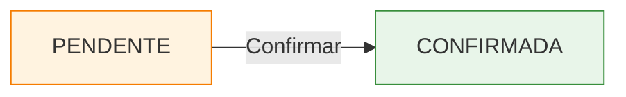

# Confirmar Coleta

A confirmação de coleta é o registro de que o veículo da transportadora chegou e a carga foi retirada com sucesso. Essa etapa muda o status da coleta de **Pendente** para **Confirmada**.

## Confirmar Recebimento

<Steps>
  <Step title="Acessar a tela">
    No menu lateral, navegue até **100 - Gestão de Fretes > Coletas > 110 - Confirmar Coleta**.
  </Step>
  <Step title="Localizar a coleta">
    A tela exibe as coletas com status **Pendente**. Utilize os filtros para encontrar a coleta desejada.
  </Step>
  <Step title="Verificar os dados">
    Confira os dados da coleta: transportadora, motorista, veículo e carregamento.
  </Step>
  <Step title="Confirmar">
    Clique no botão **Confirmar Coleta** para registrar a confirmação.
  </Step>
</Steps>

## Status da Coleta

| Status | Descrição |
|--------|-----------|
| **PENDENTE** | Coleta agendada, aguardando chegada do veículo |
| **CONFIRMADA** | Veículo chegou e carga foi retirada |

## Registro no Histórico

Ao confirmar uma coleta, o sistema registra automaticamente:

- **Data e hora** da confirmação
- **Usuário** que realizou a confirmação
- **Mudança de status** de Pendente para Confirmada

<Note>
  A confirmação de coleta é irreversível. Após confirmada, o status não pode ser revertido para Pendente. Verifique os dados antes de confirmar.
</Note>
