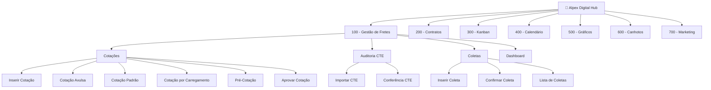

# Alpex Digital Hub

O **Alpex Digital Hub** é uma plataforma completa de gestão logística desenvolvida para otimizar processos de frete, contratos, comunicação interna e acompanhamento operacional. A plataforma centraliza as operações em um único ambiente digital, eliminando processos manuais e garantindo rastreabilidade em todas as etapas.

## Para quem é a plataforma

- **Operadores logísticos** — responsáveis por criar cotações, coletas e fazer upload de documentos fiscais
- **Gestores** — responsáveis por aprovar cotações, analisar dashboards e tomar decisões estratégicas
- **Administradores** — responsáveis por configurar permissões, parametrizações e acessos

## Principais Módulos

## Resumo dos Módulos

| Módulo | Descrição |
|--------|-----------|
| **100 - Gestão de Fretes** | Fluxo completo de cotação, aprovação, coleta e auditoria de fretes |
| **200 - Contratos** | Gestão de contratos, obrigações, tipos e setores |
| **300 - Kanban** | Quadro Kanban para acompanhamento de tarefas e fluxos |
| **400 - Calendário** | Visualização de eventos e prazos em calendário |
| **500 - Gráficos** | Dashboards e gráficos analíticos |
| **600 - Canhotos** | Upload e gestão de comprovantes de entrega |
| **700 - Marketing** | Gestão de posts e relatórios de marketing |

## Recursos Gerais

- **Controle de permissões** — cada usuário vê apenas os módulos e funcionalidades que tem acesso
- **Personalização de colunas** — todas as tabelas permitem reordenar e ocultar colunas
- **Exportação de dados** — exportação para Excel em diversas telas
- **Notificações em tempo real** — alertas automáticos para eventos importantes
- **Responsivo** — funciona em desktop e dispositivos móveis
- **Autenticação 2FA** — segurança com autenticação de dois fatores

<Note>
  Esta documentação foca principalmente no módulo de **Gestão de Fretes (100)**, que é o módulo mais completo e utilizado da plataforma.
</Note>
