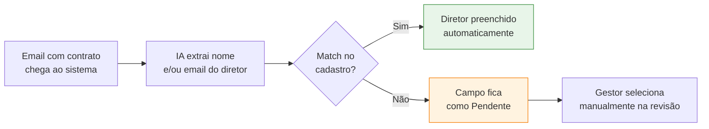

# Cadastro de Diretores

Os **diretores** são as pessoas que aprovam contratos via link público antes da assinatura digital. Apenas diretores cadastrados e ativos podem ser selecionados como aprovadores em uma solicitação.

## Onde fica

Acesse pelo menu **Solicitações de Contrato → Diretores**, ou diretamente na seção de cadastros.

## Campos do cadastro

| Campo | Obrigatório | Descrição |
|-------|-------------|-----------|
| **Nome** | Sim | Nome completo do diretor |
| **Email** | Sim | Email institucional — recebe os links de aprovação |
| **Matrícula** | Recomendado | Identificação interna |
| **Cargo** | Recomendado | Cargo formal |
| **Status** | Sim | Ativo / Inativo |

<Warning>
  O **email** é usado para enviar o link público de aprovação. Confira-o cuidadosamente ao cadastrar — um email errado significa que o diretor não receberá o link.
</Warning>

## Como o cadastro é usado

Quando uma solicitação chega por email com IA:

1. A IA tenta identificar o diretor responsável a partir do corpo do email ou do PDF.
2. O sistema cruza o nome ou email extraído com o cadastro de diretores **ativos**.
3. Se houver correspondência, o campo é preenchido automaticamente com badge **Auto**.
4. Se não houver, o campo fica **Pendente** e o gestor escolhe manualmente na revisão.

## Status Ativo vs. Inativo

| Status | Comportamento |
|--------|---------------|
| **Ativo** | Aparece na lista de seleção; pode ser usado em novas solicitações |
| **Inativo** | Não aparece em novos cadastros; preserva histórico em contratos antigos |

<Tip>
  Quando um diretor sai da empresa ou muda de função, **inative** em vez de excluir. Excluir quebraria o histórico dos contratos que ele aprovou.
</Tip>

## Ações disponíveis

- **Criar** novo diretor
- **Editar** diretor existente (todos os campos)
- **Ativar / Inativar** com um clique
- **Buscar** por nome, email ou matrícula

## Boas práticas

<CardGroup cols={2}>
  <Card title="Mantenha emails atualizados" icon="envelope">
    Se o email institucional do diretor mudar, atualize imediatamente — links em trânsito podem se perder.
  </Card>
  <Card title="Use status Inativo, não exclua" icon="user-slash">
    Inativar preserva o histórico; excluir quebra rastros em contratos antigos.
  </Card>
  <Card title="Cadastre todos antes do uso" icon="users-rectangle">
    Antes de ativar o intake por email, cadastre todos os diretores recorrentes — isso aumenta as chances de match automático pela IA.
  </Card>
  <Card title="Padronize o nome" icon="text-size">
    Use a forma como o nome aparece em emails e PDFs (geralmente nome completo ou primeiro + último). Apelidos atrapalham o match da IA.
  </Card>
</CardGroup>
