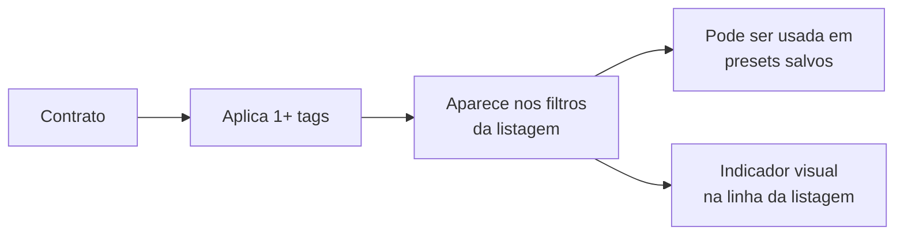

# Tags

As **Tags** são uma forma de **categorização livre** dos contratos. Diferente de campos estruturados como tipo ou setor, as tags permitem agrupar contratos por critérios próprios da operação — projetos, prioridades, características especiais, etc.

## Onde fica

Acesse em **Solicitações de Contrato → Tags**.

## Campos da tag

| Campo | Obrigatório | Descrição |
|-------|-------------|-----------|
| **Nome** | Sim | Nome curto e identificador |
| **Cor** | Sim | Cor de destaque para visualização |
| **Descrição** | Não | Quando usar a tag |

## Exemplos de uso

| Tag | Cor | Quando usar |
|-----|-----|-------------|
| `Estratégico` | Azul | Contratos críticos para o negócio |
| `Renovação automática` | Verde | Contratos com renovação tácita |
| `Alto risco` | Vermelho | Contratos com cláusulas sensíveis |
| `Projeto Alpha` | Roxo | Contratos vinculados ao projeto Alpha |
| `Sob disputa` | Laranja | Contratos com pendência jurídica ativa |

<Tip>
  Tags são **livres** — crie as que fizerem sentido para o seu negócio. Se uma tag deixar de ser útil, exclua sem cerimônia.
</Tip>

## Como aplicar tags

Em qualquer contrato (solicitação ou contrato em vigência), na tela de detalhe há um campo **Tags** que aceita múltiplas seleções. Você pode adicionar e remover a qualquer momento.

## Filtragem por tags

Tanto a listagem de Solicitações quanto a de Contratos em Vigência permitem **filtrar por uma ou mais tags**. Combine com outros filtros para visões precisas, por exemplo:

> "Contratos `Estratégicos` do setor `TI` que vencem em 90 dias"

## Aplicação em massa

Na listagem, é possível selecionar múltiplos contratos e aplicar uma tag em todos de uma vez — útil ao categorizar contratos de um projeto recém-criado.

## Reaproveitamento entre V2 e C3

As tags são **compartilhadas** entre as duas esteiras. A mesma tag pode ser aplicada tanto a uma solicitação quanto a um contrato em vigência. Isto é intencional: muitas vezes uma categoria começa relevante na entrada e continua relevante na vigência.

## Boas práticas

<CardGroup cols={2}>
  <Card title="Padronize nomes" icon="text-size">
    Evite criar variações como `Estratégico`, `estrategico`, `ESTRATÉGICO`. Defina uma convenção e respeite.
  </Card>
  <Card title="Use cores com significado" icon="palette">
    Reserve vermelho para alertas/risco, verde para "tudo certo", amarelo para atenção. Facilita leitura visual da listagem.
  </Card>
  <Card title="Não exagere na quantidade" icon="filter">
    Mais de 5 ou 6 tags por contrato deixa de ser categorização e vira ruído. Escolha as mais relevantes.
  </Card>
  <Card title="Limpeza periódica" icon="broom">
    Revise a lista de tags ocasionalmente e remova as que pararam de ser usadas — mantém a base limpa para os usuários.
  </Card>
</CardGroup>

## Edição e exclusão

- **Editar**: nome e cor podem ser alterados — todos os contratos com a tag são atualizados automaticamente.
- **Excluir**: ao excluir uma tag, ela é **removida de todos os contratos**. Há uma confirmação obrigatória mostrando quantos contratos serão impactados.
