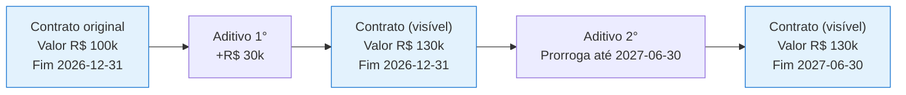

# Aditivos

Um **aditivo** é uma alteração formal ao contrato durante sua vigência. Pode ser uma extensão de prazo, mudança de valor, alteração de escopo ou qualquer outra modificação relevante. Os aditivos são **versionados sequencialmente** — `1°, 2°, 3°...` — e ficam preservados no histórico do contrato.

<Note>
  Aditivos são a forma correta de registrar mudanças contratuais. Edições diretas nos campos do contrato não geram trilha de auditoria adequada para o histórico jurídico.
</Note>

## Quando criar um aditivo

| Situação | Tipo recomendado |
|----------|------------------|
| Prorrogação do prazo de vigência | Aditivo de prazo |
| Mudança no valor | Aditivo financeiro |
| Alteração no objeto / escopo | Aditivo de escopo |
| Substituição de cláusulas | Aditivo de termos |
| Mudança de partes (ex.: cisão, fusão do parceiro) | Aditivo de qualificação |

## Como criar

1. Abra o contrato em **Contratos → clicar na linha**.
2. Vá para a aba **Aditivos**.
3. Clique em **Novo Aditivo**.
4. Preencha os campos:

| Campo | Obrigatório | Descrição |
|-------|-------------|-----------|
| **Tipo de aditivo** | Sim | Prazo, financeiro, escopo, termos, qualificação |
| **Descrição** | Sim | Resumo da alteração |
| **Data de vigência** | Sim | Quando passa a valer |
| **PDF do aditivo** | Recomendado | Documento assinado da alteração |
| **Novo valor** | Condicional | Para aditivos financeiros |
| **Nova data de fim** | Condicional | Para aditivos de prazo |

5. Salve.

O aditivo recebe automaticamente o **próximo número** na sequência (1°, 2°, etc.) e fica vinculado ao contrato.

## Listagem de aditivos

Dentro da aba Aditivos do contrato, todos os aditivos aparecem ordenados cronologicamente:

| Coluna | Conteúdo |
|--------|----------|
| **Versão** | 1°, 2°, 3°, ... |
| **Tipo** | Categoria do aditivo |
| **Data de vigência** | Quando passou a valer |
| **Descrição** | Resumo |
| **Anexo** | Link para baixar o PDF |

Clicar em uma linha abre o detalhe completo do aditivo.

## Reflexo nos campos do contrato

Quando você cria um aditivo de **prazo** ou **financeiro**, o sistema atualiza os campos visíveis do contrato (data de fim ou valor) para refletir o aditivo mais recente, mas **mantém o histórico** de cada versão.

## Boas práticas

<CardGroup cols={2}>
  <Card title="Anexe o PDF assinado" icon="file-arrow-up">
    Sempre que possível, anexe o PDF do aditivo já assinado pelas partes — vira referência jurídica do registro.
  </Card>
  <Card title="Descreva claramente" icon="pen">
    Use a descrição para resumir a alteração de forma autoexplicativa. Quem ler 2 anos depois deve entender sem precisar abrir o anexo.
  </Card>
  <Card title="Vigência precisa" icon="calendar">
    Atenção à data de vigência — alguns aditivos retroagem, outros têm efeito futuro. Registre a data correta.
  </Card>
  <Card title="Vincule comentários" icon="comment">
    Use os comentários do contrato para documentar negociações que levaram ao aditivo. Útil em casos futuros similares.
  </Card>
</CardGroup>
