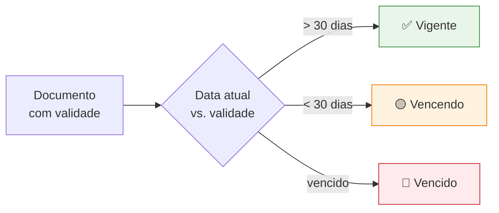

# Documentos Suplementares

A aba **Documentos** é onde você anexa **arquivos adicionais relacionados ao contrato** que não são o contrato em si nem aditivos formais. Procurações, certidões, declarações, comprovantes, addenda informais — tudo isso vive aqui.

## Como anexar

1. Abra o contrato em vigência.
2. Vá para a aba **Documentos**.
3. Clique em **Novo Documento**.
4. Preencha:

| Campo | Obrigatório | Descrição |
|-------|-------------|-----------|
| **Tipo de documento** | Sim | Categoria (ver lista abaixo) |
| **Arquivo** | Sim | PDF, imagem ou documento |
| **Nome amigável** | Sim | Descrição curta para identificar |
| **Data de validade** | Condicional | Para certidões/documentos que expiram |
| **Observações** | Não | Notas adicionais |

5. Salve.

## Tipos de documento

| Tipo | Exemplos |
|------|----------|
| **Procuração** | Procurações outorgando poderes para assinatura |
| **Certidão** | Certidões negativas, regularidade fiscal, FGTS |
| **Declaração** | Declarações de capacidade, idoneidade |
| **Comprovante** | Comprovantes de pagamento, registros de cartório |
| **Anexo técnico** | Especificações, ANS, escopo detalhado |
| **Apólice** | Seguros vinculados ao contrato |
| **Outro** | Casos não cobertos pelos tipos acima |

## Listagem

Na aba, os documentos aparecem em uma tabela:

| Coluna | Conteúdo |
|--------|----------|
| Tipo | Categoria com ícone |
| Nome | Nome amigável |
| Data de upload | Quando foi anexado |
| Validade | Data de expiração (se houver) |
| Tamanho | Tamanho do arquivo |
| Ações | Baixar, editar, excluir |

## Documentos com validade

Para tipos como **Certidões**, é altamente recomendado preencher a **Data de validade**. O sistema usa essa data para:

- 🔴 **Marcar visualmente** documentos vencidos
- 🟡 **Alertar** documentos vencendo nos próximos 30 dias
- 📊 **Filtrar** na listagem por status de validade

## Substituição vs. novo upload

Quando uma certidão expira e você obtém uma nova:

- **Recomendado**: anexe um **novo documento** do mesmo tipo, mantendo o anterior no histórico.
- **Não recomendado**: substituir o arquivo do registro existente — perde-se o rastro de quando o anterior valia.

<Tip>
  Manter o histórico dos documentos vencidos é importante em auditorias — mostra que houve regularidade ao longo da vigência.
</Tip>

## Limites e formatos

| Limite | Valor |
|--------|-------|
| Tamanho máximo por arquivo | 20 MB |
| Formatos aceitos | PDF, JPG, PNG, DOC, DOCX, XLS, XLSX |
| Quantidade por contrato | Sem limite definido |

## Diferença entre Documentos e Aditivos

| Aspecto | Documentos | Aditivos |
|---------|-----------|----------|
| **Natureza** | Anexos de apoio | Alterações formais ao contrato |
| **Versionamento** | Não numerados | Versão sequencial (1°, 2°, ...) |
| **Reflexo nos campos** | Nenhum | Pode atualizar valor, prazo |
| **Uso típico** | Certidões, procurações | Prorrogação, mudança de valor |

<Note>
  Se a alteração modifica termos do contrato, é **aditivo**. Se é documento de apoio que existe paralelamente, é **documento**.
</Note>
