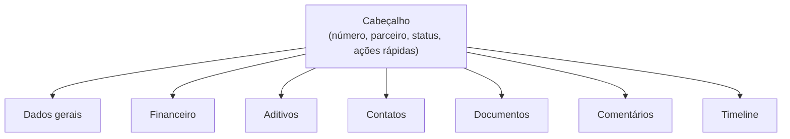

# Gestão — Detalhe do Contrato

A tela `/contratos/{id}` é o **painel completo** de operação sobre um contrato em vigência. A partir daqui você acessa todos os dados, faz mudanças de status, gerencia aditivos, contatos e documentos.

## Estrutura da tela

A tela é organizada em um cabeçalho com os dados principais e abas para as diferentes áreas de gestão.

## Cabeçalho

Sempre visível no topo, exibe:

- **Número** (`CTR-AAAA-NNN`)
- **Parceiro** e **CNPJ**
- **Status atual** com selo colorido
- **Datas** de início e fim de vigência
- **Ações rápidas**: baixar PDF, mudar status, criar aditivo, abrir solicitação de origem

## Abas

### Dados Gerais

Informações básicas do contrato, todas editáveis pelo time autorizado:

| Campo | Descrição |
|-------|-----------|
| **Tipo de contrato** | Categoria |
| **Objeto** | Descrição do que é contratado |
| **Setor demandante** | Setor interno |
| **Responsável interno** | Pessoa que conduz o contrato |
| **Diretor aprovador** | Quem aprovou (preenchido da solicitação) |
| **Tags** | Categorização livre |
| **Observações** | Anotações internas |

### Financeiro

Dados financeiros do contrato:

| Campo | Descrição |
|-------|-----------|
| **Valor total** | Valor cheio do contrato |
| **Número de parcelas** | Quantidade de pagamentos |
| **Periodicidade de pagamento** | Mensal, trimestral, anual, único |
| **Forma de pagamento** | Boleto, transferência, etc. |
| **Multa por atraso** | Percentual ou valor |
| **Juros de mora** | Percentual mensal |
| **Renovação automática** | Sim/Não |
| **Reajustes aplicados** | Histórico de reajustes (índice, percentual, data-base) |

### Aditivos

Gestão de aditivos versionados — ver [Aditivos](/gestao-contratos/contratos/aditivos).

### Contatos

Pessoas-chave do parceiro — ver [Contatos do Parceiro](/gestao-contratos/contratos/contatos-parceiro).

### Documentos

Anexos suplementares — ver [Documentos](/gestao-contratos/contratos/documentos).

### Comentários

Comentários internos sobre o contrato. Suportam:

- **Comentários públicos** — visíveis para todos com acesso ao contrato
- **Comentários privados** — restritos ao autor e a perfis com permissão equivalente

Útil para registrar conversas, decisões e contextos que precisam ser consultados depois.

### Timeline

Histórico cronológico de tudo que aconteceu com o contrato:

- Criação a partir da solicitação
- Mudanças de status (com responsável e justificativa)
- Aditivos criados
- Documentos anexados
- Edições de campos relevantes

A timeline é gerada automaticamente — você não precisa registrar nada manualmente.

## Mudanças de status

A partir do botão de ações no cabeçalho, é possível executar as transições válidas conforme o estado atual:

| Estado origem | Transições possíveis |
|---------------|----------------------|
| **Aguardando Revisão** | Em Elaboração, Cancelado |
| **Em Elaboração** | Ativo, Cancelado |
| **Ativo** | Suspenso, Encerrado, Expirado, Cancelado |
| **Suspenso** | Ativo (retomar), Cancelado |
| **Encerrado / Expirado / Cancelado** | (estados terminais — sem transições) |

<Note>
  Toda mudança de status pede uma **justificativa** que fica registrada na timeline para auditoria.
</Note>

## Boas práticas

<CardGroup cols={2}>
  <Card title="Mantenha contatos atualizados" icon="address-book">
    Quando o parceiro troca de pessoa de contato, atualize na aba Contatos. Isso evita comunicações perdidas no fim da vigência.
  </Card>
  <Card title="Use comentários como log" icon="comment">
    Reuniões, alinhamentos verbais, decisões — registre nos comentários. Vira referência valiosa em renovações futuras.
  </Card>
  <Card title="Crie aditivo em vez de editar" icon="layer-group">
    Para qualquer alteração contratual relevante (prazo, valor, escopo), crie um **aditivo** versionado em vez de editar os campos diretamente.
  </Card>
  <Card title="Anexe documentos relevantes" icon="paperclip">
    Procurações, certidões, comprovantes — manter tudo no contrato facilita auditorias e renovações.
  </Card>
</CardGroup>
