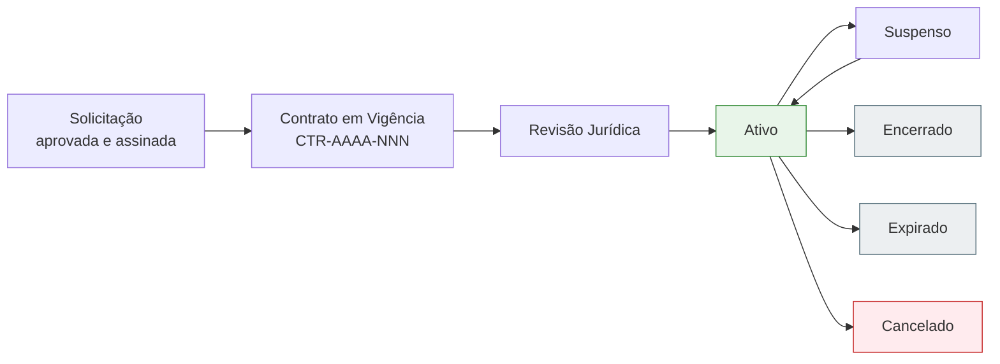

# Visão Geral — Contratos em Vigência

A esteira de **Contratos em Vigência** (`/contratos/`) é onde o contrato vive **depois de assinado**. Aqui o time jurídico revisa cláusulas finais, gerencia aditivos, mantém atualizados os contatos do parceiro e os documentos suplementares, e controla quando o contrato expira ou é encerrado.

## De onde vem o contrato em vigência

Todo contrato nesta esteira **começa na esteira de Solicitações** e é promovido automaticamente quando assinado. Não é necessário criar manualmente — o sistema gera o registro com numeração única assim que a assinatura digital é concluída.



## Numeração de contratos

Cada contrato em vigência recebe um número no formato:

```
CTR-AAAA-NNN
```

| Parte | Significado |
|-------|-------------|
| `CTR` | Prefixo fixo |
| `AAAA` | Ano de criação |
| `NNN` | Sequencial dentro do ano (zerado todo ano) |

Exemplo: `CTR-2026-001` é o primeiro contrato criado em 2026.

<Note>
  A numeração é **única e atômica** — mesmo com várias pessoas operando ao mesmo tempo, não existe duplicidade nem buraco na sequência.
</Note>

## Estados do contrato em vigência

| Estado | Descrição |
|--------|-----------|
| **Aguardando Revisão** | Recém-criado a partir da solicitação assinada. Time jurídico precisa revisar cláusulas finais |
| **Em Elaboração** | Revisão jurídica em andamento (ajustes finais, complementos) |
| **Ativo** | Em vigência — produzindo efeitos |
| **Suspenso** | Pausado temporariamente; pode voltar para Ativo |
| **Encerrado** | Finalizado normalmente após o término |
| **Expirado** | Atingiu a data de fim sem renovação |
| **Cancelado** | Encerrado antecipadamente, fora do curso normal |

## Operações disponíveis

<CardGroup cols={2}>
  <Card title="Listagem de contratos" href="/gestao-contratos/contratos/listagem" icon="list">
    Visão completa com filtros, busca e ordenação.
  </Card>
  <Card title="Gestão (detalhe)" href="/gestao-contratos/contratos/gestao-detalhe" icon="file-pen">
    Tela completa com todos os dados, abas e operações de um contrato.
  </Card>
  <Card title="Aditivos" href="/gestao-contratos/contratos/aditivos" icon="layer-group">
    Gestão de versões e alterações ao longo da vigência.
  </Card>
  <Card title="Contatos do parceiro" href="/gestao-contratos/contratos/contatos-parceiro" icon="address-book">
    Cadastro das pessoas-chave da contraparte.
  </Card>
  <Card title="Documentos suplementares" href="/gestao-contratos/contratos/documentos" icon="paperclip">
    Anexos extras: procurações, certidões, addenda.
  </Card>
</CardGroup>

## Diferenças entre Solicitação e Contrato em Vigência

| Aspecto | Solicitação | Contrato em Vigência |
|---------|-------------|----------------------|
| **Quando existe** | Antes da assinatura | Após a assinatura |
| **Identificação** | ID interno | Número `CTR-AAAA-NNN` |
| **Foco** | Coleta, análise e aprovação | Gestão durante a vigência |
| **Mudanças no PDF** | Não — é o documento original recebido | Sim — aditivos podem alterar termos |
| **Quem opera** | Gestor de contratos | Time jurídico + gestor |
| **Encerra com** | Aprovação e assinatura | Encerramento, expiração ou cancelamento |

<Tip>
  Mesmo após o contrato virar **Vigência**, a solicitação original fica preservada como histórico. Você pode acessá-la pelo link "Solicitação de origem" na ficha do contrato.
</Tip>
