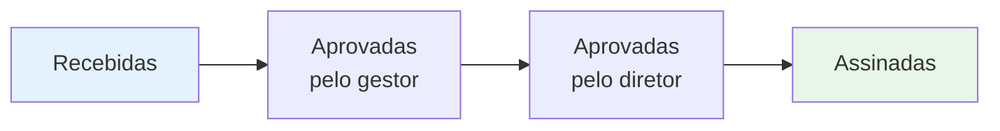

# Dashboard de Contratos

O dashboard reúne os principais indicadores do módulo de contratos. É a tela ideal para acompanhamento gerencial — visão consolidada do volume, status e tendências da operação.

## Onde fica

Acesse em **Solicitações de Contrato → Dashboard**.

## Painéis disponíveis

### 1. Visão geral por status

Distribuição dos contratos pelos diferentes estados, separados por esteira:

| Esteira | Estados |
|---------|---------|
| **Solicitações** | Aguardando Revisão, Em Aprovação, Aguardando Assinatura, Aprovado, Reprovado |
| **Contratos em Vigência** | Aguardando Revisão, Em Elaboração, Ativo, Suspenso, Encerrado, Expirado, Cancelado |

Apresentado como gráfico de barras horizontal e cards numéricos.

### 2. Funil de aprovação

Mostra a conversão da esteira de solicitações:

Cada etapa exibe o número absoluto e a taxa de conversão.

### 3. Tempo médio por etapa

Quanto tempo, em média, uma solicitação leva em cada estado:

| Etapa | Métrica |
|-------|---------|
| **Aguardando Revisão** | Tempo médio até o gestor revisar |
| **Em Aprovação** | Tempo médio até o diretor decidir |
| **Aguardando Assinatura** | Tempo médio até a assinatura |
| **Total** | Da entrada à assinatura |

Útil para identificar gargalos no fluxo.

### 4. Top parceiros

Ranking de parceiros por:

- **Volume de contratos** (quantidade)
- **Valor agregado** (R$ total)

Apresentado como lista ordenada com possibilidade de filtrar por período.

### 5. Distribuição por setor

Gráfico de pizza ou barras mostrando o volume de contratos demandados por cada setor.

### 6. Análise de risco agregada

Para contratos vindos da esteira por email com IA:

| Classificação | Quantidade |
|---------------|------------|
| 🟢 **Baixo risco** | Total no período |
| 🟡 **Médio risco** | Total no período |
| 🔴 **Alto risco** | Total no período |

### 7. Contratos vencendo

Painel de alerta com contratos em vigência que vencem em breve:

| Faixa | Indicador |
|-------|-----------|
| **Próximos 30 dias** | 🔴 Crítico |
| **Próximos 60 dias** | 🟡 Atenção |
| **Próximos 90 dias** | 🟢 Acompanhar |

Lista clicável — leva direto para a ficha do contrato.

### 8. Tendências mensais

Série temporal mostrando, por mês:

- Solicitações recebidas
- Contratos assinados
- Contratos encerrados

Útil para visualizar sazonalidade e crescimento.

## Filtros do dashboard

Os painéis respondem a filtros globais aplicados no topo:

- **Período** (mês atual, últimos 30/60/90 dias, ano, customizado)
- **Setor**
- **Tipo de contrato**
- **Tags**

## Exportação

Os dados consolidados podem ser exportados para Excel — ver [Exportação de Dados](/funcionalidades-gerais/exportacao-dados).

## Boas práticas de uso

<CardGroup cols={2}>
  <Card title="Reuniões mensais" icon="calendar-check">
    Use o dashboard como pauta de reuniões mensais com diretoria e jurídico — funil + tempo médio + alto risco já dão excelente visão.
  </Card>
  <Card title="Atenção ao vencimento" icon="bell">
    Cheque o painel de "Contratos vencendo" semanalmente — antecipar renovações evita lacunas operacionais.
  </Card>
  <Card title="Identifique gargalos" icon="hourglass">
    Tempo médio alto em "Em Aprovação" geralmente indica diretor sobrecarregado. Use o dado para redistribuir.
  </Card>
  <Card title="Compare períodos" icon="chart-column">
    Compare o mês atual com o anterior para identificar mudanças de volume — base para dimensionamento da equipe.
  </Card>
</CardGroup>
