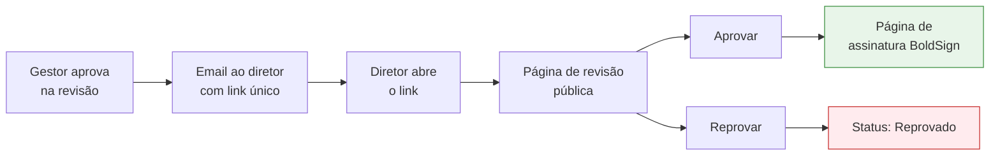

# Aprovação pelo Diretor

A aprovação do diretor é feita por meio de um **link público único**, enviado por email — o diretor **não precisa ter acesso ao sistema** nem fazer login. Isto agiliza o processo e simplifica a vida de quem aprova esporadicamente.

## Como o diretor recebe

Quando o gestor aprova a solicitação na revisão interna, o diretor (definido no campo "Diretor aprovador") recebe automaticamente um email contendo:

- Resumo da solicitação
- Nome do parceiro, valor e período
- **Link único** para a página de aprovação
- Aviso de validade (link expira em 30 dias)

## A página pública de aprovação

Ao clicar no link, o diretor vê uma página com:

| Seção | Conteúdo |
|-------|----------|
| **Cabeçalho** | Logo Alpex, identificação da solicitação |
| **Detalhes** | Parceiro, tipo, valor, datas, setor |
| **Análise de risco resumida** | Classificação visual + principais pontos de atenção |
| **PDF do contrato** | Visualizador embutido para leitura completa |
| **Botões** | **Aprovar** e **Reprovar** |

## As decisões do diretor

### Aprovar

Ao clicar em **Aprovar**:

1. O sistema cria automaticamente o **envelope de assinatura digital** (BoldSign).
2. O diretor é levado direto para a tela de assinatura — ver [Assinatura Digital](/gestao-contratos/solicitacoes/assinatura-digital).
3. A solicitação muda para **Aguardando Assinatura**.

### Reprovar

Ao clicar em **Reprovar**:

1. O diretor confirma a ação.
2. A solicitação muda para **Reprovado**.
3. O remetente original e o gestor são notificados.
4. O link fica marcado como usado (não pode ser reutilizado).

## Segurança do link

O link de aprovação tem várias camadas de proteção:

<CardGroup cols={2}>
  <Card title="Token único" icon="key">
    Cada solicitação gera um link diferente, com 64 caracteres aleatórios.
  </Card>
  <Card title="Uso único" icon="lock">
    Após qualquer decisão (aprovar ou reprovar), o link fica invalidado.
  </Card>
  <Card title="Expiração de 30 dias" icon="clock">
    Após 30 dias sem ação, o link expira automaticamente.
  </Card>
  <Card title="Token nunca armazenado em claro" icon="shield-halved">
    O link só existe no email enviado — o sistema guarda apenas um hash, então um vazamento do banco não expõe links ativos.
  </Card>
</CardGroup>

## Mensagens que o diretor pode ver

Dependendo do estado do link, ao acessá-lo o diretor pode encontrar:

| Situação | Mensagem |
|----------|----------|
| Link válido e contrato em aprovação | Página normal de revisão |
| Link já usado | "Esta solicitação já foi decidida" |
| Link expirado (>30 dias) | "Este link expirou — solicite um novo ao gestor" |
| Solicitação em estado inválido | "Esta solicitação não está mais disponível para aprovação" |

## Reenvio do link

Se o diretor perder o email ou o link expirar, o gestor pode **reenviar** pela tela de revisão (ainda em estado **Em Aprovação**). Um novo token é gerado e o link antigo é invalidado.

<Note>
  Se a solicitação já tiver passado para **Aguardando Assinatura**, não é mais possível reenviar — o link de aprovação foi consumido. A partir desse ponto, o diretor recebe um link diferente, vindo do BoldSign, para a assinatura.
</Note>

## E se o diretor não responder?

Não há expiração automática além dos 30 dias do link. Recomendações:

- O gestor pode acompanhar pelo status na listagem (filtro "Em Aprovação")
- Se necessário, comunicar o diretor por outro canal lembrando do email
- Para casos urgentes, o link pode ser reenviado a qualquer momento

## Próximo passo

Quando o diretor aprova, ele é levado imediatamente para a [Assinatura Digital](/gestao-contratos/solicitacoes/assinatura-digital).
