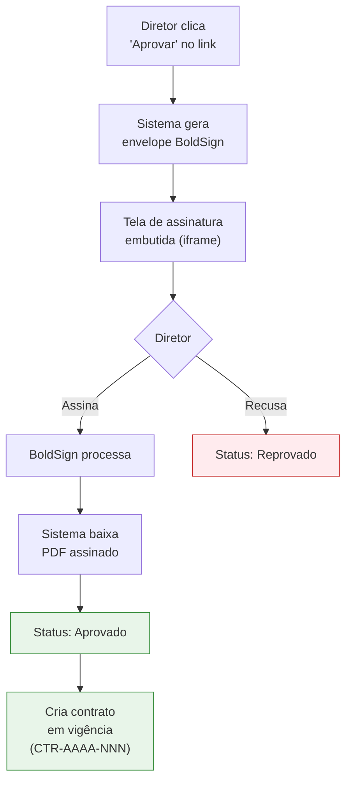

# Assinatura Digital

A assinatura digital é feita pelo **BoldSign**, integrado ao sistema. Logo após o diretor aprovar o contrato no link público, ele é levado automaticamente para a tela de assinatura — sem precisar trocar de aba ou fazer download.

## Fluxo de ponta a ponta

## Como o diretor assina

A página de assinatura é totalmente embutida no navegador:

1. Aparece o **PDF do contrato** com uma **página de assinatura** anexada ao final automaticamente.
2. O diretor clica nos campos de assinatura indicados.
3. O sistema captura a assinatura (desenhada, digitada ou carregada).
4. O diretor confirma e finaliza.

Nenhum software adicional é necessário. Funciona em desktop, tablet e celular.

## A página de assinatura anexa

Toda solicitação ganha uma **página adicional** ao final do PDF, contendo:

- Identificação do contrato
- Nome e dados do diretor
- Campo para assinatura
- Data e hora da assinatura
- Carimbo digital de validação

Esta página é gerada automaticamente pelo sistema antes do envelope ser enviado.

## Após a assinatura

Quando o diretor finaliza:

1. O **BoldSign notifica o sistema** automaticamente.
2. O sistema **baixa o PDF assinado** e o armazena.
3. A solicitação muda para **Aprovado**.
4. Notificações são disparadas (gestor, remetente, time interno).
5. **Um novo registro é criado automaticamente na esteira de [Contratos em Vigência](/gestao-contratos/contratos/visao-geral)**, com numeração `CTR-AAAA-NNN`.

<Note>
  A criação do contrato em vigência é **automática e independente** — você não precisa fazer nada. Em poucos segundos o novo contrato aparece em `/contratos/`.
</Note>

## Se o diretor recusar a assinatura

Mesmo após aprovar, o diretor pode recusar no momento da assinatura (clicando em "Decline" no BoldSign). Nesse caso:

1. O sistema é notificado do declínio.
2. A solicitação muda para **Reprovado**.
3. O motivo da recusa (se informado) é registrado.
4. O remetente e o gestor são notificados.

## Garantias técnicas

<CardGroup cols={2}>
  <Card title="PDF assinado armazenado" icon="floppy-disk">
    O sistema guarda o PDF final assinado — você pode baixá-lo a qualquer momento na ficha do contrato.
  </Card>
  <Card title="Validação de webhook" icon="shield-check">
    Toda notificação do BoldSign é validada criptograficamente antes de ser aceita.
  </Card>
  <Card title="Reconciliação automática" icon="arrows-rotate">
    Se a notificação falhar por algum motivo, o sistema verifica periodicamente o estado das assinaturas pendentes e se atualiza.
  </Card>
  <Card title="Idempotência" icon="check-double">
    Mesmo se a notificação chegar duplicada, o sistema processa apenas uma vez — sem efeitos colaterais.
  </Card>
</CardGroup>

## Acompanhamento durante a assinatura

Enquanto o diretor está com a janela aberta, há um **polling discreto** que pergunta ao BoldSign se a assinatura foi concluída. Isto cobre cenários onde a notificação automática demora para chegar — o usuário não fica preso esperando.

## Páginas finais que o diretor vê

| Resultado | Página exibida |
|-----------|----------------|
| Assinatura concluída | "Contrato assinado com sucesso! Obrigado." |
| Recusa | "Você recusou a assinatura. O solicitante foi notificado." |

## Casos excepcionais

### Webhook não chega

Se o canal de notificação do BoldSign estiver indisponível, o sistema tem um **job de reconciliação** que roda periodicamente, consultando o BoldSign diretamente para identificar contratos parados em **Aguardando Assinatura** que já foram assinados externamente.

### Diretor abandona a tela

Se o diretor fechar a janela sem assinar, o contrato fica em **Aguardando Assinatura**. Ele pode retornar mais tarde ao mesmo link enviado por email — o BoldSign mantém a sessão de assinatura disponível.

## Próximo passo

Após a assinatura, o contrato passa a viver na esteira de [Contratos em Vigência](/gestao-contratos/contratos/visao-geral) — onde será gerido durante todo o período de vigor.
