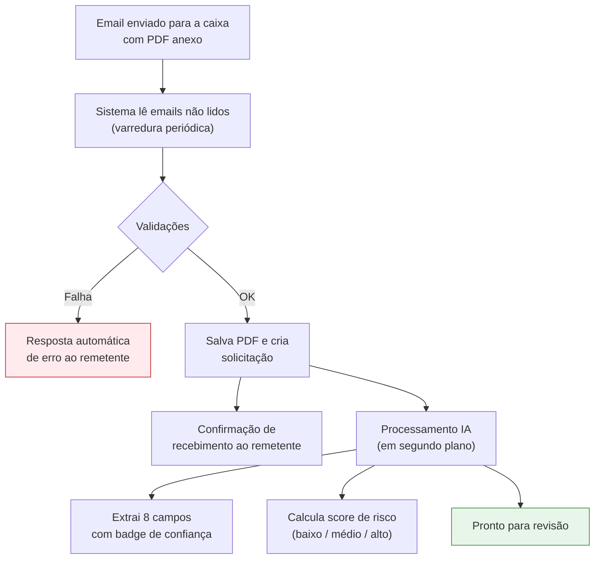

# Intake por Email com Inteligência Artificial

Este é o **fluxo principal** de entrada de contratos. O sistema monitora uma caixa de email dedicada, identifica anexos PDF, extrai os campos relevantes com IA e analisa o nível de risco automaticamente — tudo antes da solicitação chegar à sua tela de revisão.

## Como funciona

## Requisitos do email

Para que o email seja processado, ele precisa atender:

| Requisito | Detalhe |
|-----------|---------|
| **Anexo** | Pelo menos um arquivo PDF |
| **Tamanho** | PDF de até 20 MB |
| **Tipo do arquivo** | `application/pdf` (não pode ser Word, imagem, etc.) |
| **Remetente** | Endereço de email válido |
| **Assunto e corpo** | Não podem estar vazios |

<Warning>
  Se o email não atender aos requisitos, o remetente recebe uma **resposta automática de erro** explicando o motivo, e a solicitação **não é criada**.
</Warning>

## Idempotência

Cada email tem um identificador único. Se o mesmo email for lido duas vezes (por algum motivo), o sistema **ignora a segunda leitura** automaticamente — você nunca verá a mesma solicitação duplicada na listagem.

## Campos extraídos pela IA

A IA lê o **corpo do email + texto do PDF** e tenta preencher 8 campos:

| Campo | Descrição |
|-------|-----------|
| **Parceiro** | Razão social ou nome da contraparte |
| **Tipo de contrato** | Categoria do contrato |
| **Valor** | Valor total |
| **Data de início** | Início da vigência |
| **Data de fim** | Fim da vigência |
| **Setor demandante** | Setor interno solicitante |
| **Nome do diretor** | Diretor que deverá aprovar |
| **Email do diretor** | Email para envio do link de aprovação |

### Badges de confiança

Cada campo extraído recebe um indicador visual de confiança:

| Badge | Significado | O que fazer |
|-------|-------------|-------------|
| 🟢 **Auto** | A IA encontrou o valor com alta certeza | Apenas conferir |
| 🟡 **Inferido** | A IA deduziu o valor a partir do contexto | Conferir com atenção |
| 🔴 **Pendente** | A IA não conseguiu extrair com segurança | Preenchimento humano obrigatório |

### Resolução automática do diretor

O sistema cruza o nome ou email extraído pela IA com o cadastro de [Diretores](/gestao-contratos/cadastros/diretores). Se encontrar correspondência, marca o campo como **Auto**. Se não encontrar, mantém como **Pendente** para o gestor escolher manualmente na revisão.

## Análise de risco

Em paralelo à extração de campos, o sistema calcula um **score de risco** combinando:

- **Análise por palavras-chave** — busca termos sensíveis no texto (multas, penalidades, exclusividade, etc.)
- **Análise semântica por IA** — leitura contextual das cláusulas

O resultado é apresentado na revisão como:

| Classificação | Score | Cor |
|---------------|-------|-----|
| **Baixo** | < 30 | 🟢 Verde |
| **Médio** | 30 a 60 | 🟡 Amarelo |
| **Alto** | > 60 | 🔴 Vermelho |

Junto com o score, a tela de revisão exibe:

- **Pontos de atenção** detectados
- **Resumo executivo** do contrato
- **Cláusulas identificadas** que merecem destaque

## PDF ilegível

Se o PDF for uma imagem escaneada sem camada de texto (ou estiver corrompido), o sistema marca a flag **PDF ilegível**. A solicitação ainda é criada e aparece na revisão, mas:

- Os campos da IA virão majoritariamente como **Pendente**
- Você precisará preencher tudo manualmente
- O PDF pode ser visualizado normalmente, mas precisará ser lido pelo gestor

<Tip>
  Para evitar isso, peça aos remetentes que enviem PDFs com texto pesquisável (gerados a partir de Word, Google Docs ou exportados digitalmente) em vez de digitalizações.
</Tip>

## Confirmação ao remetente

Assim que a solicitação é criada com sucesso, o sistema envia automaticamente um **email de confirmação** ao remetente original, indicando que o contrato foi recebido e está em análise.

## Próximo passo

Após o processamento da IA (geralmente alguns minutos), a solicitação aparece na listagem com status **Aguardando Revisão**, pronta para a [Revisão Interna](/gestao-contratos/solicitacoes/revisao-interna).
