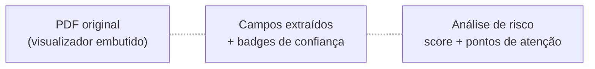
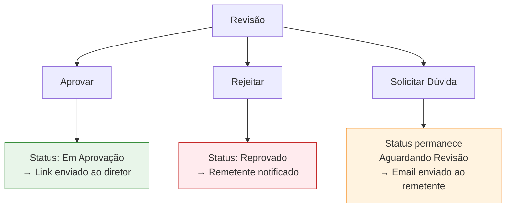

# Revisão Interna

A revisão interna é o **primeiro filtro humano** da solicitação. Aqui o gestor confere os dados extraídos pela IA, faz correções, e decide o que acontece em seguida.

A tela é acessada em **Solicitações de Contrato → clicar na linha → Revisar**, ou diretamente em `/solicitacoes-contrato/revisao/{id}`.

## O que a tela exibe

A tela é dividida em três áreas principais:

### Área 1 — Campos extraídos

Cada campo aparece com:

- **Valor** (editável)
- **Badge de confiança** (auto / inferido / pendente)
- **Fonte** (de onde a IA tirou: corpo do email, texto do PDF, ou inferência)

Você pode editar qualquer campo livremente. Ao salvar, o campo passa a ter **fonte = humana** e **confiança = auto**.

### Área 2 — Análise de risco

| Elemento | Descrição |
|----------|-----------|
| **Score numérico** | 0 a 100 |
| **Classificação** | Visual (verde / amarelo / vermelho) |
| **Pontos de atenção** | Lista de termos ou cláusulas detectados |
| **Resumo executivo** | Descrição curta do contrato gerada pela IA |
| **Cláusulas identificadas** | Trechos que merecem leitura cuidadosa |

### Área 3 — PDF original

Visualizador embutido do PDF para conferência paralela. Permite navegar páginas e dar zoom sem precisar baixar o arquivo.

## As três ações possíveis

### Aprovar

Use quando os dados estão corretos e o contrato pode seguir para o diretor.

**O que acontece:**

1. O sistema valida que todos os campos obrigatórios estão preenchidos.
2. A solicitação muda para **Em Aprovação**.
3. Um **token único** é gerado.
4. Um email é enviado ao diretor com o **link público** de aprovação.

<Note>
  Se algum campo estiver com badge **Pendente** ou vazio, a aprovação fica bloqueada até você preenchê-lo. Isso evita enviar contratos incompletos ao diretor.
</Note>

### Rejeitar

Use quando o contrato é inadequado, contém erros graves, ou não deve seguir adiante.

**O que acontece:**

1. Uma janela pede a **justificativa** (obrigatória).
2. A solicitação muda para **Reprovado** (estado terminal).
3. O remetente original é notificado por email com sua justificativa.

<Warning>
  A reprovação é **definitiva** no fluxo normal. Para reverter, é necessário ação administrativa direta.
</Warning>

### Solicitar Dúvida

Use quando você precisa de mais informação ou correção do remetente antes de decidir.

**O que acontece:**

1. Um modal abre para você escrever a dúvida.
2. Um email é enviado ao remetente com seu texto.
3. A solicitação **permanece em Aguardando Revisão** — não muda de status.

Esta é a opção indicada para casos como "qual a versão final?", "falta a página 3", "valor está divergente do que combinamos".

## Boas práticas

<CardGroup cols={2}>
  <Card title="Confira o PDF antes de aprovar" icon="magnifying-glass">
    A IA é boa, mas não substitui leitura humana. Sempre abra o PDF e confira ao menos os pontos críticos: parceiro, valor e datas.
  </Card>
  <Card title="Atenção a campos inferidos" icon="triangle-exclamation">
    Campos com badge **Inferido** têm maior chance de erro. Confira com mais cuidado antes de aprovar.
  </Card>
  <Card title="Use comentários" icon="comment">
    A tela permite adicionar comentários (públicos ou privados) que ficam no histórico do contrato.
  </Card>
  <Card title="Verifique a análise de risco" icon="shield">
    Score alto não bloqueia aprovação, mas indica que vale uma leitura mais cuidadosa das cláusulas destacadas.
  </Card>
</CardGroup>

## Histórico e auditoria

Toda ação na tela de revisão fica registrada com:

- Usuário que executou
- Data e hora
- Estado anterior e novo
- Justificativa (quando aplicável)

O histórico fica visível na **timeline** da solicitação.

## Próximo passo

Após você aprovar, a bola passa para o diretor — veja [Aprovação do Diretor](/gestao-contratos/solicitacoes/aprovacao-diretor).
