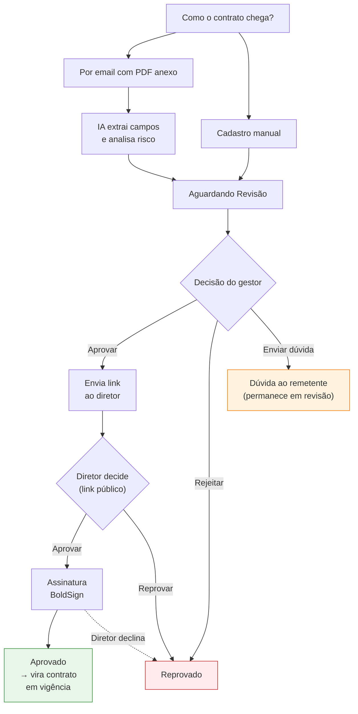

# Visão Geral — Solicitações de Contrato

A tela **Solicitações de Contrato** (`/solicitacoes-contrato/`) é o ponto central da esteira de entrada. É aqui que você acompanha todos os contratos que ainda não foram assinados — desde os que acabaram de chegar por email até os que estão aguardando assinatura do diretor.

## Pipeline de uma solicitação

## Estados de uma solicitação

| Estado | O que significa |
|--------|------------------|
| **Aguardando Revisão** | Contrato chegou (por email ou manual) e está esperando o gestor revisar |
| **Em Aprovação** | Gestor aprovou e o link público foi enviado ao diretor |
| **Aguardando Assinatura** | Diretor aprovou e o envelope BoldSign foi criado, esperando a assinatura |
| **Aprovado** | Diretor assinou digitalmente; o contrato foi promovido para a esteira de vigência |
| **Reprovado** | Rejeitado em alguma etapa (gestor, diretor ou recusa de assinatura) |

## Caminhos de entrada

<CardGroup cols={2}>
  <Card title="Cadastro Manual" href="/gestao-contratos/solicitacoes/criacao-manual" icon="pen-to-square">
    Para casos em que o documento é entregue fisicamente ou fora do canal de email padrão.
  </Card>
  <Card title="Intake por Email com IA" href="/gestao-contratos/solicitacoes/intake-email-ia" icon="envelope">
    O fluxo principal: o sistema lê emails da caixa de entrada, extrai campos do PDF e analisa risco.
  </Card>
</CardGroup>

## Etapas de tratamento

<CardGroup cols={3}>
  <Card title="Revisão Interna" href="/gestao-contratos/solicitacoes/revisao-interna" icon="eye">
    Conferência dos dados extraídos pela IA e decisão do gestor.
  </Card>
  <Card title="Aprovação do Diretor" href="/gestao-contratos/solicitacoes/aprovacao-diretor" icon="user-check">
    Link público enviado por email — o diretor decide sem fazer login.
  </Card>
  <Card title="Assinatura Digital" href="/gestao-contratos/solicitacoes/assinatura-digital" icon="signature">
    Assinatura via BoldSign embutida no navegador.
  </Card>
</CardGroup>

## Filtros disponíveis na listagem

A tela de listagem permite filtrar por:

- **Status** (aguardando revisão, em aprovação, aguardando assinatura, aprovado, reprovado)
- **Parceiro** (busca por razão social ou CNPJ)
- **Tags** (categorização livre — ver [Tags](/gestao-contratos/cadastros/tags))
- **Setor** demandante
- **Diretor responsável**
- **Período** (data de criação, data de início ou fim de vigência)
- **Canal de entrada** (email ou manual)
- **Classificação de risco** (baixo, médio, alto)

<Tip>
  Filtros aplicados podem ser **salvos como presets** por usuário. Útil para visões recorrentes como "contratos do meu setor aguardando minha revisão".
</Tip>

## Próximo passo após a assinatura

Quando uma solicitação chega ao status **Aprovado**, o sistema cria automaticamente um registro na esteira de [Contratos em Vigência](/gestao-contratos/contratos/visao-geral), com numeração no formato `CTR-AAAA-NNN`. A solicitação original fica preservada como histórico.
