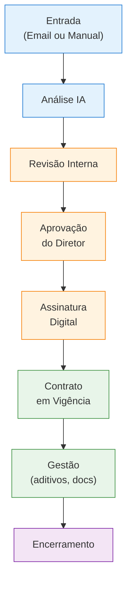

# Visão Geral — Gestão de Contratos

O módulo de **Gestão de Contratos** cobre todo o ciclo de vida de um contrato corporativo, desde a chegada do documento até o seu encerramento. Ele é dividido em duas grandes esteiras que se conectam automaticamente:

- **Solicitações de Contrato** — esteira de entrada: recebimento (manual ou por email), análise com IA, revisão, aprovação pelo diretor e assinatura digital.
- **Contratos em Vigência** — gestão pós-assinatura: aditivos, contatos do parceiro, documentos anexos e controle de status do contrato em vigor.

## Fluxo Completo

## As duas esteiras

### Solicitações de Contrato

A esteira de entrada que prepara o contrato até a assinatura. Telas em `/solicitacoes-contrato/`.

| Etapa | Descrição |
|-------|-----------|
| **Entrada** | O contrato chega por email (com PDF anexo) ou é cadastrado manualmente |
| **Análise IA** | O sistema extrai campos do PDF e analisa o nível de risco automaticamente |
| **Revisão Interna** | O gestor revisa os dados extraídos, corrige o que for necessário e decide aprovar, reprovar ou enviar dúvida ao remetente |
| **Aprovação do Diretor** | O diretor recebe um link público por email e aprova ou reprova sem precisar fazer login |
| **Assinatura Digital** | Ao aprovar, o diretor assina o documento via BoldSign embutido no navegador |

### Contratos em Vigência

A gestão do contrato após a assinatura. Telas em `/contratos/`.

Quando um contrato é assinado na esteira anterior, o sistema **gera automaticamente** um registro nesta esteira com um número único no formato `CTR-AAAA-NNN` (ex.: `CTR-2026-001`).

| Operação | Descrição |
|----------|-----------|
| **Revisão jurídica** | O time legal revisa cláusulas e detalhes financeiros antes da ativação |
| **Ativação** | O contrato passa a vigorar |
| **Aditivos** | Novas versões versionadas do contrato (alteração de prazo, valor, cláusulas) |
| **Contatos** | Cadastro de pessoas-chave do parceiro |
| **Documentos** | Anexos suplementares (procurações, certidões, addenda) |
| **Encerramento** | Suspensão, cancelamento, expiração ou encerramento normal |

## Papéis Envolvidos

| Papel | Responsabilidades |
|-------|-------------------|
| **Gestor de Contratos** | Revisar contratos recebidos, corrigir dados extraídos, aprovar para envio ao diretor, gerenciar aditivos e obrigações |
| **Diretor** | Aprovar ou reprovar contratos via link público; assinar digitalmente |
| **Time Jurídico** | Revisar cláusulas no estado pós-assinatura (C3) |
| **Administrador** | Cadastrar diretores, tags, setores e configurar permissões |

## Como navegar nesta documentação

<CardGroup cols={2}>
  <Card title="Solicitações de Contrato" href="/gestao-contratos/solicitacoes/visao-geral" icon="inbox">
    Esteira de entrada: email/manual → IA → revisão → aprovação → assinatura
  </Card>
  <Card title="Contratos em Vigência" href="/gestao-contratos/contratos/visao-geral" icon="file-signature">
    Gestão pós-assinatura: aditivos, contatos, documentos
  </Card>
  <Card title="Cadastros Auxiliares" href="/gestao-contratos/cadastros/diretores" icon="users">
    Diretores, tags e setores que alimentam o módulo
  </Card>
  <Card title="Dashboard" href="/gestao-contratos/dashboard" icon="chart-line">
    KPIs, breakdown por status e indicadores do módulo
  </Card>
</CardGroup>
