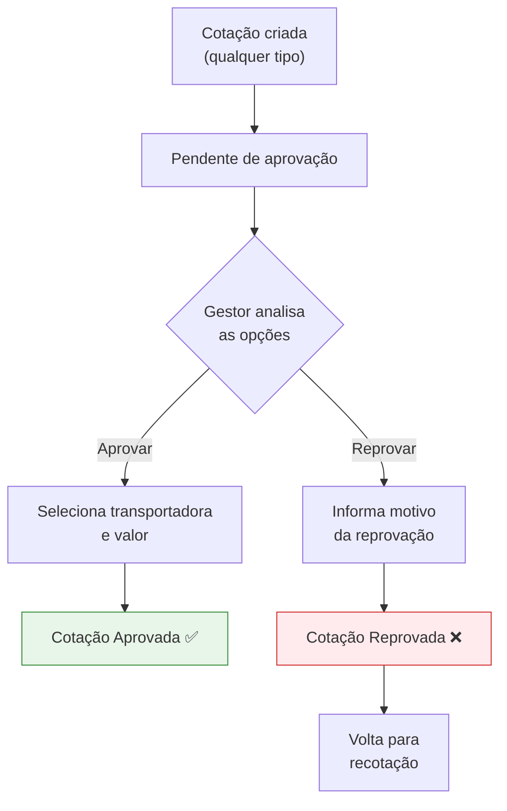

# Aprovação de Cotação

A aprovação de cotação é a etapa em que o gestor analisa as propostas de frete e seleciona a melhor opção para cada pedido. Todas as cotações criadas nas diferentes telas convergem para esta tela de aprovação.

## Fluxo de Aprovação

## Opções de Cotação

Na tela de aprovação, o gestor visualiza até **9 opções de valor** para cada pedido:

| Categoria | Opções |
|-----------|--------|
| **Cotação padrão** | Transportadora 1, Transportadora 2, Transportadora 3 |
| **Recotação** | Recotação 1, Recotação 2, Recotação 3 |
| **Negociação** | Valor negociado com transportadora |
| **Ocorrência** | Valor de ocorrência |
| **CTE Complementar** | Valor de CTE complementar |

## Aprovar uma Cotação

<Steps>
  <Step title="Acessar a tela">
    No menu lateral, navegue até **100 - Gestão de Fretes > Gestão de Cotação > 105 - Aprovar Cotação**.
  </Step>
  <Step title="Localizar o pedido">
    Use os filtros ou a busca direta por número do pedido para encontrar a cotação desejada.
  </Step>
  <Step title="Abrir detalhes">
    Clique no pedido para visualizar os detalhes e todas as opções de cotação.
  </Step>
  <Step title="Analisar as opções">
    Compare os valores das transportadoras, incluindo cotação padrão, recotação, negociação e ocorrência.
  </Step>
  <Step title="Selecionar a melhor opção">
    Clique no botão **Aprovar** na opção de transportadora escolhida.
  </Step>
  <Step title="Confirmar">
    Confirme a aprovação na janela de confirmação. O status do pedido muda para **Aprovado**.
  </Step>
</Steps>

## Reprovar uma Cotação

<Steps>
  <Step title="Localizar o pedido">
    Encontre o pedido na lista de cotações pendentes.
  </Step>
  <Step title="Clicar em Reprovar">
    Clique no botão **Reprovar** para abrir o formulário de reprovação.
  </Step>
  <Step title="Informar o motivo">
    Preencha o campo **Motivo da Reprovação** com a justificativa (obrigatório).
  </Step>
  <Step title="Confirmar reprovação">
    Clique em **Confirmar** para reprovar a cotação. O pedido volta para o operador para recotação.
  </Step>
</Steps>

<Warning>
  O motivo da reprovação é **obrigatório**. Não é possível reprovar uma cotação sem justificativa.
</Warning>

## Cotações Agrupadas

Quando pedidos fazem parte de um agrupamento (por carregamento ou cotação), o sistema exibe automaticamente todos os pedidos do grupo. O gestor pode visualizar o contexto completo antes de aprovar.

## Tabela de Pedidos

| Coluna | Descrição |
|--------|-----------|
| **Ação** | Botões de aprovar/reprovar |
| **Data** | Data do pedido |
| **Tipo** | Tipo do pedido (normal ou avulso) |
| **N. Pedido** | Número do pedido |
| **Filial** | Filial de origem |
| **Agrupamento** | Grupo de carregamento |
| **Valor** | Valor total do pedido |
| **Cod. Cliente** | Código do cliente |
| **Cliente** | Nome do cliente |
| **Documento** | CNPJ/CPF |
| **Peso (Kg)** | Peso total |
| **N. Carregamento** | Número do carregamento |
| **Data Entrega** | Data prevista de entrega |
| **Tipo Frete Redespacho** | CIF ou FOB |
| **Tipo Frete Padrão** | CIF, FOB, Gratuito, Próprio CIF, Próprio FOB, Terceiro |
| **Praça** | Praça de destino |
| **Município** | Município de destino |
| **Estado** | Estado de destino |

## Filtros Disponíveis

| Filtro | Descrição |
|--------|-----------|
| **Data (de/até)** | Período dos pedidos |
| **Número do Pedido** | Busca direta |
| **Valor (de/até)** | Faixa de valor |
| **Cod. Cliente** | Código do cliente |
| **Cliente** | Nome do cliente |
| **CNPJ** | Documento do cliente |
| **Peso (de/até)** | Faixa de peso |
| **Data Entrega (de/até)** | Período de entrega |
| **Tipo Frete Redespacho** | CIF ou FOB |
| **Tipo Frete Padrão** | CIF, FOB, etc. |
| **Estado** | Estado de destino |
| **Município** | Município de destino |
| **Praça** | Praça de destino |
| **Status** | Pendente, Aprovado ou Reprovado |

## Status da Cotação

| Status | Descrição |
|--------|-----------|
| **Pendente** | Aguardando análise do gestor |
| **Aprovado** | Gestor selecionou uma transportadora |
| **Reprovado** | Gestor rejeitou as opções com justificativa |

<Note>
  Por padrão, a tela exibe apenas cotações **pendentes** (que ainda não foram aprovadas e possuem ao menos uma opção de cotação preenchida). Utilize o filtro de status para visualizar cotações já aprovadas ou reprovadas.
</Note>
