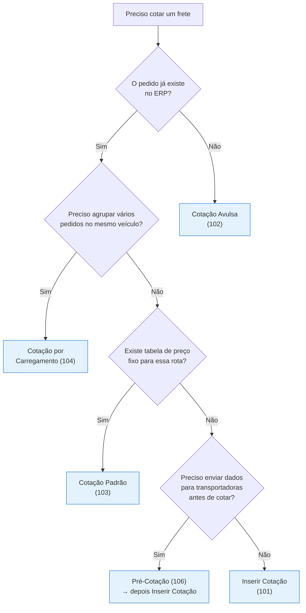

# Visão Geral — Cotações

O Alpex Digital Hub oferece diferentes tipos de cotação para atender cenários distintos no processo logístico. Entender quando usar cada tipo é fundamental para otimizar o fluxo de trabalho.

## Tipos de Cotação

| Tipo | Código | Descrição | Melhor para |
|------|--------|-----------|-------------|
| **Inserir Cotação** | 101 | Cotação direta vinculada a pedidos do ERP | Pedidos já existentes no sistema |
| **Cotação Avulsa** | 102 | Cotação individual por cliente, não vinculada a pedido ERP | Fretes avulsos ou extraordinários |
| **Cotação Padrão** | 103 | Tabela fixa de valores por tipo de veículo | Rotas e veículos com preço tabelado |
| **Cotação por Carregamento** | 104 | Agrupa pedidos por carregamento | Múltiplos pedidos no mesmo veículo |
| **Pré-Cotação** | 106 | Preparação de dados para cotação futura | Envio prévio para transportadoras |

## Fluxograma de Decisão

## Funcionalidades Comuns a Todas as Cotações

- **Filtros avançados** — cada tela possui filtros específicos para localizar cotações
- **Personalização de colunas** — reordenar e ocultar colunas conforme sua preferência
- **Exportação para Excel** — exportar dados filtrados para planilha
- **Ordenação** — clicar no cabeçalho da coluna para ordenar crescente/decrescente
- **Paginação** — navegação por páginas para grandes volumes de dados

## Fluxo Após a Cotação

Após criar uma cotação (em qualquer modalidade), o próximo passo é a **aprovação pelo gestor** na tela de [Aprovar Cotação](/gestao-frete/aprovacao-cotacao).

<Note>
  Cada tipo de cotação gera registros que aparecem automaticamente na tela de aprovação. O gestor não precisa saber em qual tela a cotação foi criada — todas convergem para o mesmo fluxo de aprovação.
</Note>
