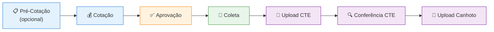

# Visão Geral — Gestão de Frete

O módulo de **Gestão de Frete** é o coração do Alpex Digital Hub. Ele cobre todo o ciclo de vida de um frete, desde a cotação até a conferência dos documentos fiscais.

## Fluxo Completo

## Etapas do Fluxo

### 1. Pré-Cotação (Opcional)

A pré-cotação permite preparar e organizar os dados antes de iniciar a cotação formal. Pode ser criada manualmente ou importada via planilha Excel. É enviada por email automaticamente para as transportadoras.

### 2. Cotação

A cotação é o processo de obter e registrar os valores de frete junto às transportadoras. Existem 4 tipos:

| Tipo | Descrição |
|------|-----------|
| **Cotação Avulsa** | Cotação individual por pedido/cliente |
| **Cotação por Carregamento** | Agrupa pedidos por número de carregamento |
| **Cotação Padrão** | Tabela fixa de valores por tipo de veículo e transportadora |
| **Inserir Cotação** | Cotação direta vinculada a pedidos do ERP |

### 3. Aprovação

O gestor analisa as cotações recebidas (até 3 opções de transportadora + recotação + negociação + ocorrência + CTE complementar) e seleciona a melhor opção. Também pode reprovar com justificativa.

### 4. Coleta

Após a aprovação, a coleta é agendada. O sistema gera uma chave de acesso e QR Code para a transportadora, e envia email automático com os detalhes da coleta.

### 5. Upload de CTE

O Conhecimento de Transporte Eletrônico (CTE) é importado via upload de XMLs. O sistema extrai automaticamente os dados e valida contra os valores aprovados.

### 6. Conferência CTE

Os CTEs importados são comparados com as cotações aprovadas para identificar divergências de valores.

### 7. Upload de Canhoto

O comprovante de entrega (canhoto) é digitalizado e anexado ao processo para encerrar o ciclo.

## Papéis Envolvidos

| Papel | Responsabilidades |
|-------|-------------------|
| **Operador** | Criar cotações, coletas, fazer upload de CTE e canhotos |
| **Gestor** | Aprovar/reprovar cotações, analisar dashboards |
| **Administrador** | Configurar permissões, parametrizações e acessos |

## Funcionalidades do Módulo

| Código | Funcionalidade | Tipo |
|--------|---------------|------|
| 101 | Inserir Cotação | Cotação |
| 102 | Cotação Avulsa | Cotação |
| 103 | Cadastro de Cotação Padrão | Cotação |
| 104 | Cotação por Carregamento | Cotação |
| 105 | Aprovar Cotação | Aprovação |
| 106 | Pré-Cotação | Cotação |
| 107 | Importar CTE | Pós-processo |
| 108 | Conferência CTE | Pós-processo |
| 109 | Inserir Coleta | Coleta |
| 110 | Confirmar Coleta | Coleta |
| 111 | Lista de Coletas | Coleta |
| 112 | Dashboard | Relatórios |
